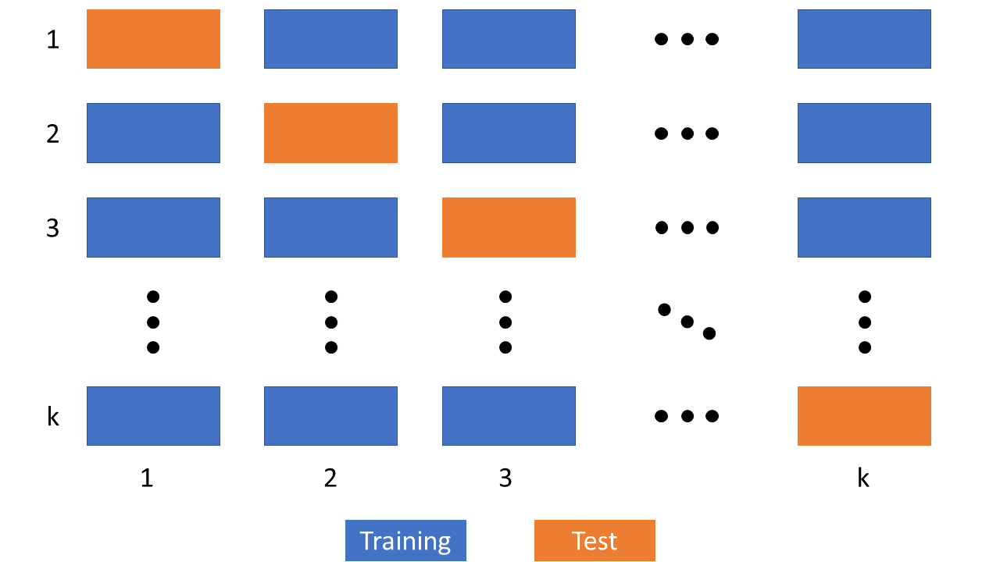

# Cross Validation Package
Python package for plug and play cross validation techniques.
If you like the idea or you find usefull this repo in your job, please leave a ⭐ to support this personal project.

* Cross Validation methods:
    * [K-fold](#k-fold);
    * [Leave One Out (LOO)](#leave-one-out-loo);
    * [Leave One Subject Out (LOSO)](#leave-one-subject-out-loso).

At the moment the package is not available using `pip install <PACKAGE-NAME>`.

For the installation from the source code click **[here](#installation)**.

Each method returns the confusion matrix and some performance metrics for each itheration and for the overall result.
The performance metrics are:
* Balanced Accuracy;
* F1 Score;
* Matthews Correlation Coefficient. 

## K-fold
K-fold consists of partitioning the dataset into k subsets; iteratively one of the k subsets is the test set and the others are the training set.
The value of k could be chosen according to the amount of available data. Increasing the value of k the result is enlarging the training set and decreasing the size of the test set. 
Tipically, the default value of k is between 5 to 10, this is a good trade of between a robust validation and computational time.
After a k-fold cross validation all the data set has been tested and it is possible to generate a confusion matrix and compute some performance metrics to validate the generalization capabilities of your model.


***K-fold cross-validation concept illustration** Each row represents an iteration of the cross-validation; in blue, there are the subsets labeled as training set and in orange, the subset defined as test set for the i-th iteration. 
At the end, each subset has been tested getting the outcome, that could be compared to the real outputs of the instances*

### Example
```python
from cross_validation.cross_validation import kfold

clf = RandomForestClassifier()
[cm, perf] = kfold(clf, X, y, verbose=True)
```

## Leave One Out (LOO)
Leave-one-out (LOO) is a particular case of the k-fold when the value of k is equal to the number of data points in the dataset.
This method should be used when the data set has few samples; this guarantees to have enough data point for the model training; after the training phase only one point will be evaluated by the model.

### Example
```python
from cross_validation.cross_validation import leave_one_out

clf = RandomForestClassifier()
[cm, perf] = leave_one_out(clf, X, y, verbose=True)
```

## Leave One Subject Out (LOSO)
This method could be considered as a different version of the leave-one-out cross-validation. This method works leaving as a test set not a single example, but the entire examples that belong to a specific subject. The other subjects’ instances are used to train the learning algorithm.
The main advantage of the LOSO is the removal of the subject bias because all the instances of the are the test set.
This technique of cross-validation is widely used in the biomedical field where the the main task is to predict a disease or a condition of a patient using data of other patients.

### Example
```python
from cross_validation.cross_validation import leave_one_subject_out

clf = RandomForestClassifier()
[cm, perf] = leave_one_subject_out(clf, X, y, subject_ids, verbose=True):
```

## Installation
For the installation from the source code type this command into your terminal window:
```
pip install git+<repository-link>
```
or
```
python -m pip install git+<repository-link>
```
or
```
python3 -m pip install git+<repository-link>
```
